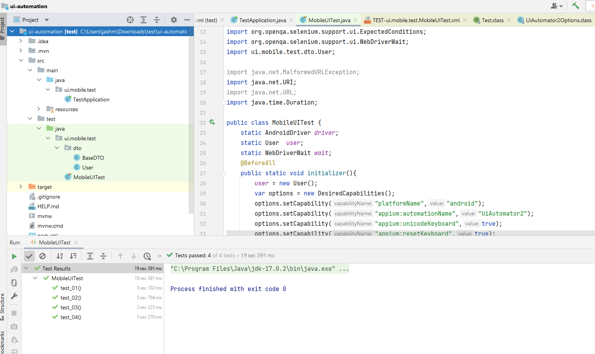

# React Native Chat App Testing

## Introduction 
ChatApp is a mobile application develop to help user exchange messages, user can view each other profiles and chat on one to one or group bases. 

## Challenge (Tasks)

- Task 1: Functional Testing (Done)
- Task 2: Usability Testing (Done)
- Task 3: Performance Testing (Done)
- Task 4: Automation (Not Done)

## Prerequesites 

- Download & Install Android Studio 
- Download & Install virtual devices 
- Download & Install appium server 
- Download & Install appium inspector
- Download & install intellij
- Download & install javasdk-17

## Environment setup
1. Open ANDROID STUDIO.
2. Click on more options 
3. Click on vertual device Manager option
4. start one of the emulator device (click on play button)
5. follow README instruction on https://github.com/Ctere1/react-native-chat. 
6. configure the server url  on the android emulator device (One time setting)

## Scope
Develop detailed test cases for the following functionalities:
- User signup
- User login
- Viewing the list of chat rooms
- Joining a chat room
- Sending and receiving messages
- Viewing user profiles
- Settings 
- Logout 
- Delete account 
- Profile 

> Note: Ensure the test cases cover both positive and negative scenarios.

## Prioritise Components (features) 

**For this step i would use an AISE Matrix, to identify the following combination:**

high impact high ease (P1 - High Impact customer's features and High ease Testing effort)

high impact low ease (P2 - High Impact customer's features and Low Testing effort)

Low impact high ease (P3 - Low customer impact features and High ease Testing effort)

Low impact low ease (P4 - Low customer impact features and Low Testing effort)

**The output of this step is a prioritised matrix**:


## Testing Approach  

In order to test the chat app,  I would follow the ACC (Attribute, component, capability) testing approach, this approach was design by google and its primary objective is to test capabilities over features, I personally find this approach very useful since it helps the team to have common understanding about the product or component

> Note: 
A capability is the intersection between an attribute and a component, for example we can be testing the Secure attribute of the login component, we can then say the 'Login component is Secure When un-authorized user Do NOT have access to ChatApp' 

**For the testing of ChatApp I would used the following attributes:**

**Secure**: Focus in finding any type of vulnerability in the application

**Compliance(Functional Testing)**: Focus in testing any expected results or acceptance criteria

**Auditable**: Focus in testing any transaction traceability

**Accessible**: Focus in testing the application from the perspective of a person with different abilities

**Usable (Usability Testing)**: Evaluating the overal user experience of the application including learnability

> Criteria: 
> - Evaluate the app’s user interface and user experience.
> - Identify any usability issues and provide suggestions for improvement.
> - Focus on aspects such as navigation, layout consistency, and user feedback.
> - Assess the ease of use for common tasks such as sending messages and navigating between chat rooms.

**Fast (Performance Testing)**: Evaluating the performance aspect of the application and its response time

> Criteria:  
> - Conduct basic performance testing to measure the app’s responsiveness and load times.
> - Test the app’s performance under different network conditions (e.g., 3G, 4G, Wi-Fi).
> - Measure the time taken for messages to be sent and received.
> - Document the performance metrics and any observed issues. 

## Test Report

### [Download Report Here...](https://github.com/NeerajaMaddala/React-native-app-testing/raw/main/Matrix_Reactapp.xlsx)


## Automation setup

### Process 

1. Open a java project with intellij
2. Build the project 
3. Run the Test

### Test covered 

- Signup --> (test01)
- Logout --> (test02)
- Login --> (test03)
- Delete account --> (test04)

### Automated testing

```java
package ui.mobile.test;

import io.appium.java_client.AppiumBy;
import io.appium.java_client.android.AndroidDriver;
import org.junit.jupiter.api.AfterAll;
import org.junit.jupiter.api.BeforeAll;
import org.junit.jupiter.api.Order;
import org.junit.jupiter.api.Test;
import org.openqa.selenium.remote.DesiredCapabilities;
import org.openqa.selenium.support.ui.ExpectedConditions;
import org.openqa.selenium.support.ui.WebDriverWait;
import ui.mobile.test.dto.User;

import java.net.URI;
import java.time.Duration;

public class MobileUITest {
    static AndroidDriver driver;
    static User user;
    static WebDriverWait wait;

    @BeforeAll
    public static void initializer() {
        user = new User();
        var options = new DesiredCapabilities();
        options.setCapability("platformName", "android");
        options.setCapability("appium:automationName", "UiAutomator2");
        options.setCapability("appium:unicodeKeyboard", true);
        options.setCapability("appium:resetKeyboard", true);
        try {
            driver = new AndroidDriver(
                    // The default URL in Appium 1 is http://127.0.0.1:4723/wd/hub
                    URI.create("http://127.0.0.1:4723").toURL(), options
            );
            wait = new WebDriverWait(driver, Duration.ofSeconds(10));
        } catch (Exception ex) {
            throw new RuntimeException("unable to start the driver");
        }
    }

    @Test
    @Order(1)
    public void test_01() {
        //Tap on signup
        var signUpButton = driver.findElement(AppiumBy.androidUIAutomator("new UiSelector().text(\" Sign Up\")"));
        signUpButton.click();
        //Enter name
        wait.until(ExpectedConditions.visibilityOfElementLocated(AppiumBy.androidUIAutomator("new UiSelector().text(\"Enter name\")")));
        var nameInputText = driver.findElement(AppiumBy.androidUIAutomator("new UiSelector().text(\"Enter name\")"));
        nameInputText.sendKeys(user.getFullName());
        //Enter email
        var emailInputText = driver.findElement(AppiumBy.androidUIAutomator("new UiSelector().text(\"Enter email\")"));
        emailInputText.sendKeys(user.getEmail());
        //Enter password
        var passwordInputText = driver.findElement(AppiumBy.androidUIAutomator("new UiSelector().text(\"Enter password\")"));
        passwordInputText.sendKeys(user.getPassword());
        //Tap on sign up Button
        var completeSignUpButton = driver.findElement(AppiumBy.accessibilityId(" Sign Up"));
        completeSignUpButton.click();
    }

    @Test
    @Order(2)
    public void test_02() {

        wait.until(ExpectedConditions.visibilityOfElementLocated(AppiumBy.androidUIAutomator("new UiSelector().text(\"\")")));
        var settingsButton = driver.findElement(AppiumBy.androidUIAutomator("new UiSelector().text(\"\")"));
        settingsButton.click();
        wait.until(ExpectedConditions.visibilityOfElementLocated(AppiumBy.androidUIAutomator("new UiSelector().text(\"Account\")")));
        var accountButton = driver.findElement(AppiumBy.androidUIAutomator("new UiSelector().text(\"Account\")"));
        accountButton.click();
        wait.until(ExpectedConditions.visibilityOfElementLocated(AppiumBy.androidUIAutomator("new UiSelector().text(\"Logout\")")));
        var logoutButton = driver.findElement(AppiumBy.androidUIAutomator("new UiSelector().text(\"Logout\")"));
        logoutButton.click();
        wait.until(ExpectedConditions.elementToBeClickable(AppiumBy.id("android:id/button2")));
        var confirmationButton = driver.findElement(AppiumBy.id("android:id/button2"));
        confirmationButton.click();
    }

    @Test
    @Order(3)
    public void test_03() {
        wait.until(ExpectedConditions.elementToBeClickable(AppiumBy.androidUIAutomator("new UiSelector().text(\"Enter email\")")));
        var emailInputText = driver.findElement(AppiumBy.androidUIAutomator("new UiSelector().text(\"Enter email\")"));
        emailInputText.sendKeys(user.getEmail());
        var passwordInputText = driver.findElement(AppiumBy.androidUIAutomator("new UiSelector().text(\"Enter password\")"));
        passwordInputText.sendKeys(user.getPassword());
        var loginButton = driver.findElement(AppiumBy.accessibilityId(" Log In"));
        loginButton.click();
    }

    @Test
    @Order(4)
    public void test_04() {
        wait.until(ExpectedConditions.visibilityOfElementLocated(AppiumBy.androidUIAutomator("new UiSelector().text(\"\")")));
        var settingsButton = driver.findElement(AppiumBy.androidUIAutomator("new UiSelector().text(\"\")"));
        settingsButton.click();
        wait.until(ExpectedConditions.visibilityOfElementLocated(AppiumBy.androidUIAutomator("new UiSelector().text(\"Account\")")));
        var accountButton = driver.findElement(AppiumBy.androidUIAutomator("new UiSelector().text(\"Account\")"));
        accountButton.click();
        wait.until(ExpectedConditions.visibilityOfElementLocated(AppiumBy.androidUIAutomator("new UiSelector().text(\"Delete my account\")")));
        var deleteButton = driver.findElement(AppiumBy.androidUIAutomator("new UiSelector().text(\"Delete my account\")"));
        deleteButton.click();
        wait.until(ExpectedConditions.elementToBeClickable(AppiumBy.id("android:id/button2")));
        var confirmationButton = driver.findElement(AppiumBy.id("android:id/button2"));
        confirmationButton.click();
    }

    @AfterAll
    public static void closeDriver() {
        driver.quit();
    }
}

```
## Data creation 

I use faker library to generate random data, to create users.


```java
package ui.mobile.test.dto;

import ch.qos.logback.core.util.StringUtil;

public class User extends BaseDTO {
    private String email;
    private String password;
    private String name;

    public String getEmail() {
        if (StringUtil.isNullOrEmpty(this.email)) {
            this.email = getFaker().internet().emailAddress();
        }
        return this.email;
    }


    public String getPassword() {
        if (StringUtil.isNullOrEmpty(this.password)) {
            this.password = getFaker().internet().password();
        }
        return this.password;
    }

    public String getFullName() {
        if (StringUtil.isNullOrEmpty(this.name)) {
            this.name = getFaker().funnyName().name();
        }
        return this.name;
    }


}

```

### Example of execution: 

